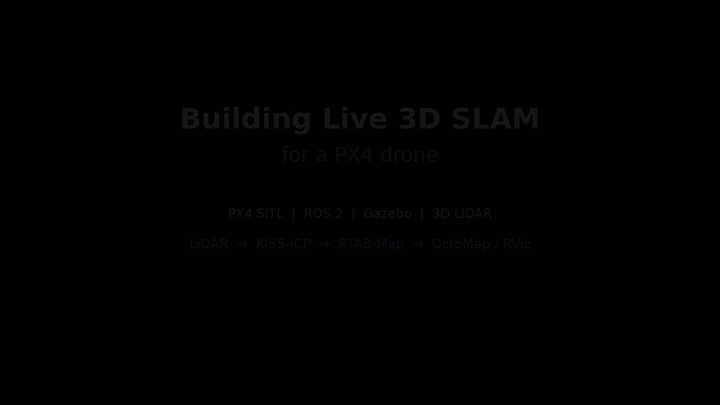

# LiDAR Mapping Drone

This project gives a simulated PX4 X500 drone a live 3D mapping pipeline. The
drone flies inside a custom Gazebo arena, observes the environment with a
project-owned 3D LiDAR, estimates its motion with KISS-ICP, and builds a
persistent map with RTAB-Map.

The current checkpoint is **stable simulated flight and live 3D SLAM**.
Autonomous 3D navigation is the next phase; the earlier navigation prototype is
preserved separately on the `feature/3d-navigation` branch.

## Demo



This 14-second highlight loop shows the Gazebo environment, raw LiDAR returns,
KISS-ICP odometry, the live OctoMap view, and the final RTAB-Map
reconstruction. The full 48-second edit adds the complete sequence and music.

Music: **Reach The Top** by Shane Ivers —
[Silverman Sound](https://www.silvermansound.com) — CC BY 4.0.

## System at a Glance

```text
QGroundControl
      |
      v
PX4 SITL in Docker ------> Gazebo X500 flight simulation
                                  |
                                  v
                             3D LiDAR
                                  |
                                  v
                           ros_gz_bridge
                                  |
                                  v
                      ROS 2 PointCloud2
                                  |
                                  v
                             KISS-ICP
                         LiDAR odometry
                                  |
                                  v
                             RTAB-Map
                    graph SLAM + saved database
                         /                \
                        v                  v
                 OctoMap in RViz    persistent 3D map
```

KISS-ICP answers, “How did the LiDAR move between scans?” RTAB-Map uses those
motion estimates and the scans to assemble a map of the complete session.
OctoMap converts the result into occupied, free, and unknown 3D space for
visualization and future planning.

## What Works Today

- PX4 `v1.17.0` and the Gazebo X500 run with GPU acceleration in Docker.
- A single simulated 3D LiDAR is mounted on the X500 and publishes at 10 Hz.
- `ros_gz_bridge` carries its live point cloud into ROS 2.
- KISS-ICP produces coherent LiDAR odometry that has been compared with PX4.
- RTAB-Map builds and saves a live 3D reconstruction of the arena.
- RViz displays the map, graph, odometry, and OctoMap occupancy.
- Ordered shutdown preserves the timestamped SLAM database.

## Quick Start

Complete the machine and external-workspace setup in
[PX4_SETUP.md](PX4_SETUP.md) first. For the normal live-mapping session:

`/mnt/px4-workspace` is a machine-specific mount point backed by a 30 GB ext4
filesystem image stored on an external hard drive. It is not part of this Git
repository and must be mounted before PX4 can run.

```bash
./scripts/px4_workspace.sh connect
./src/px4_sitl_bringup/scripts/run_px4.sh slam
```

Use QGroundControl or the project's teleoperation helper to fly through the
arena. Press `Ctrl+C` in the launch terminal to stop the complete session and
save the timestamped RTAB-Map database.

The runner also accepts `simulation` and `odometry`; running it without an
argument currently selects `odometry`. See
[the SLAM guide](docs/RTABMAP_SLAM.md) for the mode breakdown.

## View a Saved Map

Databases are written under `/mnt/px4-workspace/rtabmap_maps/`. Find the newest
one with:

```bash
ls -1t /mnt/px4-workspace/rtabmap_maps/*.db | head -n 1
```

Open the reported path:

```bash
rtabmap-databaseViewer /mnt/px4-workspace/rtabmap_maps/<database>.db
```

Choose **Yes** when asked to use the database parameters, then use
**Edit → View 3D map**. Clear **From RGB-D images** because this is a
LiDAR-only map.

## Documentation

- [Project journey](docs/PROJECT_JOURNEY.md): visual record of each mapping milestone.
- [Live RTAB-Map SLAM](docs/RTABMAP_SLAM.md): runtime, outputs, and database workflow.
- [KISS-ICP setup](docs/KISS_ICP_SETUP.md): LiDAR odometry architecture and validation.
- [X500 3D LiDAR](docs/X500_3D_LIDAR.md): sensor model, bridge, and frame relationships.

## Next Phase

The next goal is:

```text
live 3D SLAM
    -> manually selected 3D goal
    -> collision-free 3D planning
    -> PX4 Offboard execution
    -> reach the goal and hover
```

The SLAM stack is working infrastructure for that phase. Navigation will be
rebuilt deliberately from this checkpoint rather than mixed into the mapping
pipeline.
