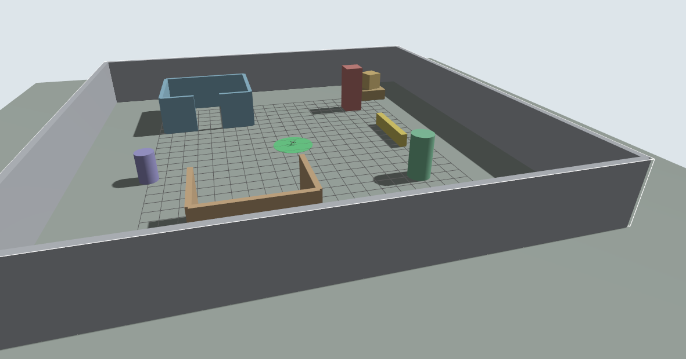
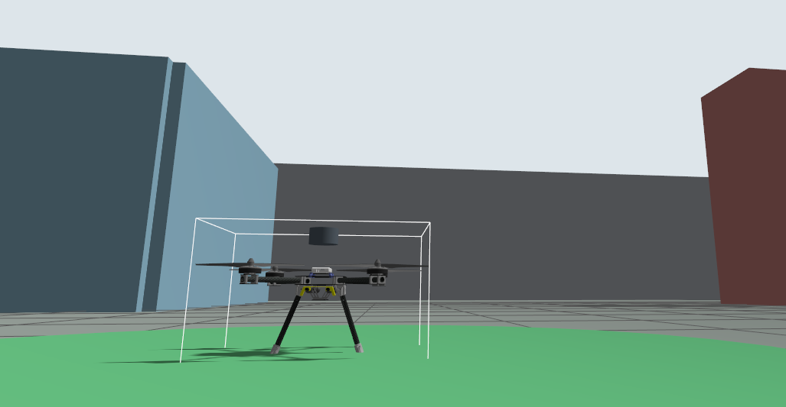
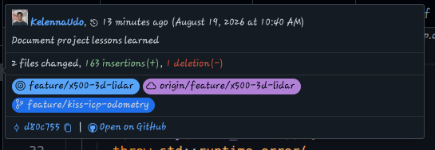
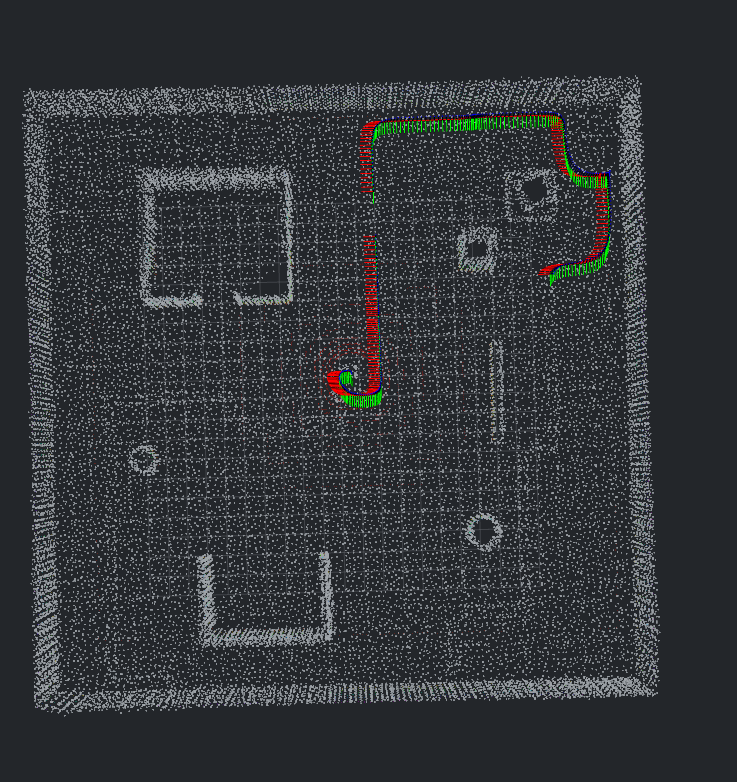
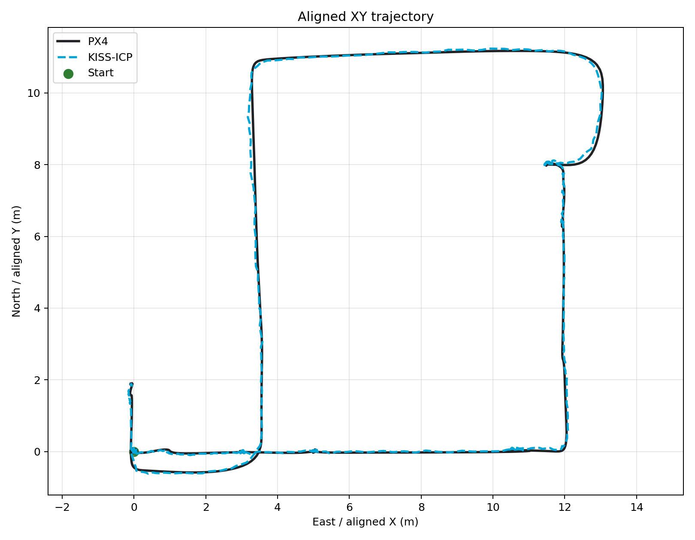
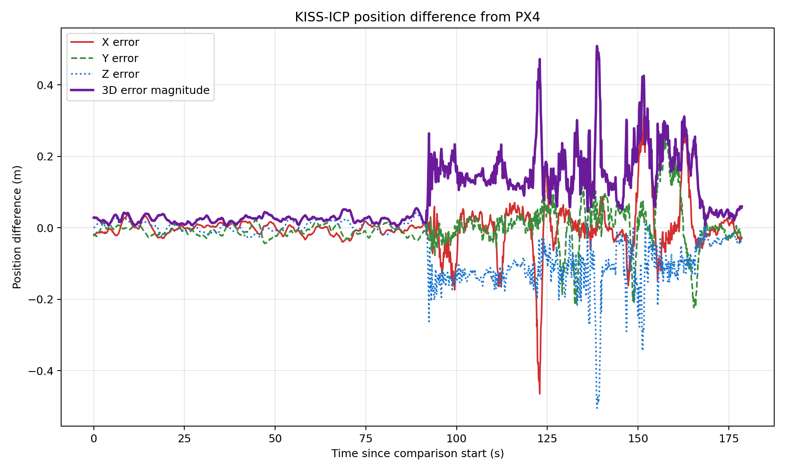

# Project Journey

This page is a visual lab notebook for the PX4 mapping workflow. It records
what each milestone added, the evidence that it worked, and the limitations
that still remained.

The project grew through one data pipeline at a time:

```text
Gazebo mapping world
        |
        v
X500-mounted 3D LiDAR
        |
        v
ROS 2 PointCloud2
        |
        v
KISS-ICP odometry and local map
        |
        v
Comparison against PX4 odometry
```

The earlier X3 custom-controller work remains an important learning sandbox
on its own branch. This page focuses on the current PX4 X500 mapping path.

## 1. Mapping Test World



The empty PX4 world was replaced by a compact, project-owned test arena. Its
walls, corners, columns, and asymmetric objects give a LiDAR scan enough
geometry to distinguish one location from another.

**This proves:** Gazebo loads the custom world and provides useful mapping
geometry.

**This does not prove:** that the sensor frames, point cloud, or odometry are
correct.

See [MAPPING_TEST_WORLD.md](MAPPING_TEST_WORLD.md) for its layout and launch
behavior.

## 2. X500 3D LiDAR



The PX4-supported X500 was extended with a project-owned `gpu_lidar` sensor.
PX4 still controls the vehicle; the new sensor adds environmental perception
without bypassing PX4's flight controller.

```text
PX4                controls flight
Gazebo             simulates the vehicle, world, and laser returns
ros_gz_bridge      converts the Gazebo point cloud into a ROS 2 message
ROS 2              carries the PointCloud2 to RViz and KISS-ICP
```

**This proves:** the sensor is physically represented on the simulated X500.

**This does not prove:** that its measurements or frame alignment are valid.

See [X500_3D_LIDAR.md](X500_3D_LIDAR.md) for the model, topic, and bridge
details.

## 3. Raw Point Cloud



The ROS 2 topic `/x500/lidar/points` publishes
`sensor_msgs/msg/PointCloud2`. In RViz, the raw returns reveal the walls,
floor, and interior objects of the Gazebo arena.

```text
Gazebo /x500/lidar/points
        |
        v
ros_gz_bridge
        |
        v
ROS 2 /x500/lidar/points
        |
        +----> RViz
        |
        +----> KISS-ICP
```

**This proves:** the complete Gazebo-to-ROS sensor pipeline is carrying a
geometrically recognizable 3D scan.

**This does not prove:** that successive scans can be aligned into accurate
motion estimates.

## 4. KISS-ICP Odometry



KISS-ICP aligns each new LiDAR scan with recent geometry. That alignment
estimates how `lidar_link` moved and accumulates the scans into a local map.
The colored frame trail shows the estimated sensor trajectory through the
arena.

Important live outputs are:

| Topic | Type | Meaning |
| --- | --- | --- |
| `/kiss/odometry` | `nav_msgs/msg/Odometry` | Estimated motion of `lidar_link` |
| `/kiss/local_map` | `sensor_msgs/msg/PointCloud2` | Point cloud accumulated by KISS-ICP |

**This proves:** KISS-ICP receives the live cloud, estimates a coherent
trajectory, and builds a recognizable local map.

**This does not prove:** absolute accuracy. LiDAR odometry can still drift
because it integrates many relative scan-to-scan estimates.

See [KISS_ICP_SETUP.md](KISS_ICP_SETUP.md) for startup, topics, storage, and
inspection commands.

## 5. Comparison With PX4



The comparison tool converts PX4's NED coordinates to ROS-style ENU,
translates both estimates to a common starting position, and rigidly aligns
their horizontal headings. It does not resize either trajectory.



The recorded comparison produced:

| Measurement | Result |
| --- | ---: |
| Duration | 178.617 s |
| KISS-ICP samples | 1,787 |
| PX4 samples | 17,866 |
| Horizontal alignment | 0.389 degrees |
| X RMSE | 0.066 m |
| Y RMSE | 0.054 m |
| Z RMSE | 0.092 m |
| 3D RMSE | 0.126 m |
| Maximum position error | 0.509 m |
| Final position error | 0.060 m |

`RMSE` means root mean square error: one number that summarizes the typical
size of the position difference while giving larger errors more weight.

These results show close agreement during this particular simulated flight.
They do not make PX4 perfect ground truth: PX4 publishes its own state
estimate, KISS-ICP tracks the LiDAR frame rather than the vehicle body, and
this first tool compares position but not orientation or velocity.

The reusable comparison scripts are documented under
[`tools/odometry_comparison/`](../tools/odometry_comparison/README.md).

## Current Mental Model

The system now has two largely independent ways to describe the same flight:

```text
Gazebo physics and PX4 sensors          Gazebo 3D LiDAR
              |                              |
              v                              v
        PX4 estimator                     KISS-ICP
              |                              |
              v                              v
/fmu/out/vehicle_odometry              /kiss/odometry
              \                              /
               +------ comparison tool -----+
```

That independence is useful. Agreement increases confidence in the pipeline;
disagreement gives us a specific signal to investigate rather than a vague
feeling that the map looks odd.

## Recording Future Milestones

For each major milestone, preserve a small amount of evidence:

1. **Goal:** What single capability were we trying to add?
2. **Architecture:** Where does it sit in the system data flow?
3. **Evidence:** Which screenshot, topic output, plot, or bag demonstrates it?
4. **Measurement:** What rate, error, duration, or resource use did we observe?
5. **Limitations:** What has not been proven yet?
6. **Reproduction:** Which command should produce the same result again?

Prefer one useful image over ten nearly identical screenshots. Git is a
project history, not a vacation slideshow, although the X500 has now seen a
surprising amount of simulated real estate.
